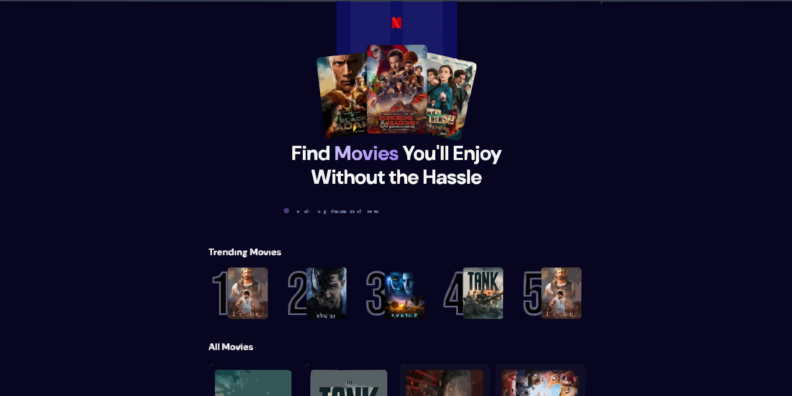

# 🎬 The Movie App using React



A simple and clean movie listing application built with **React** that displays popular movies, trending titles, and allows users to search for movies in real time.

---

## 🚀 Features

- 🎥 Displays a list of movies using TMDB data
- 🔥 Shows **Top 5 Trending Movies**
- 🔍 Search bar with debounced search
- 📊 Displays essential movie details:
  - Movie poster
  - Rating
  - Language
- ⚡ Fast, responsive, single-page UI

> This is a lightweight application focused purely on movie discovery — no videos or extra content.

---

## 🛠 Tech Stack

-  **React**
-  **Vite**
-  **JavaScript**
-  **Tailwind CSS**
-  **Appwrite**
-  **TMDB API**

---

## ⚙️ Key React Concepts Used

- `useState` – Component state management
- `useEffect` – Data fetching & side effects
- **Debounced Search**
  - Implemented using `useDebounce` from the `react-use` npm package

---

## 🧩 Backend (Simple Setup)

- Implemented a **basic backend using Appwrite**
- Created **tables** for minimal application data
- Backend kept intentionally simple to focus on frontend

---

## 📦 Installation & Setup

```bash
# Clone the repository
git clone <https://github.com/jawahaartheella/react-movie-app.git>

# Navigate to the project folder
cd the-movie-app

# Install dependencies
npm install

# Start the development server
npm run dev
```
---

## 🔐 Environment Variables

Create a `.env.local` file in the root directory and add:

```env
VITE_TMDB_API_KEY=your_api_key_here
VITE_APPWRITE_PROJECT_ID=your_appwrite_project_id_here
VITE_APPWRITE_DATABASE_ID=your_appwrite_database_id_here
VITE_APPWRITE_COLLECTION_ID=your_appwrite_collection_id_here
```

---

## 🚀 Deployment

The application is deployed using **Vercel**.

---

## 🔗 Live Demo

> https://the-movie-app-react.vercel.app

---

## 👨‍💻 Author

Jawahaar Theella
<br>
<a href="https://github.com/jawahaartheella">GitHub</a>

Built as a learning project to explore React fundamentals, hooks, API integration, debounced search, and basic backend usage with Appwrite.


